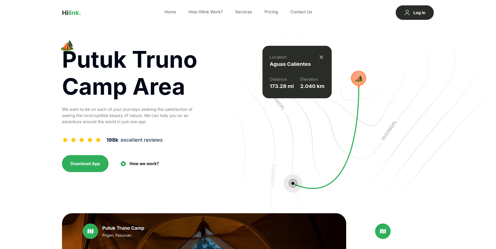

# Hilink - Hiking & Climbing Companion Website

## Overview

Hilink is a hiking and climbing companion application that helps adventurers navigate and plan their journeys. It provides real-time information, offline maps, and augmented reality features to enhance the outdoor experience.

This landing page, built using **React** and **Tailwind CSS**, showcases the features and services of Hilink in an intuitive and visually appealing way.

## Features

- **Responsive Design**: Built with mobile-first responsiveness, ensuring seamless performance across all devices.
- **Interactive UI**: Engaging and dynamic user interface components with smooth animations.
- **Customizable**: Easily modifiable components using Tailwind's utility classes.
- **Offline Maps**: Allows adventurers to download maps and use them without an internet connection.
- **Augmented Reality**: A guide feature utilizing augmented reality to help users find their way on mountain trails.
- **Social Proof**: Displaying user testimonials and reviews to build credibility.

## Sections

The website is divided into several key sections:

1. **Hero Section**:

   - Introduces the location (Putuk Truno Camp Area) with a description and call-to-action buttons to download the app.

2. **How It Works**:

   - Highlights how the app works, particularly focusing on offline maps and navigation.

3. **Guide Section**:

   - Showcases how the app can guide users on their journey with visual aids and descriptions.

4. **Features**:

   - Detailed explanation of the app’s main features including real maps, augmented reality, and frequent location updates.

5. **Testimonials**:

   - User feedback displayed in a clean grid layout.

6. **Call to Action (CTA)**:

   - Encourages users to download the app from either the App Store or Play Store.

7. **Footer**:
   - Contains contact information, links to social media, and legal information.

## Technologies Used

- **React**: JavaScript library for building user interfaces.
- **Tailwind CSS**: A utility-first CSS framework for quickly styling the components.
